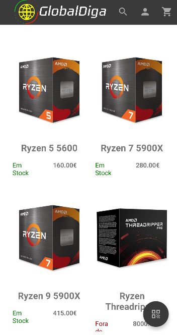
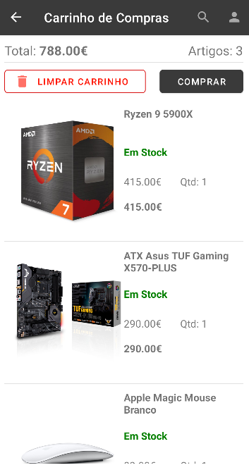

<!-- Header -->
<div align="center">
<h1>
<p align="center">
  <br>GlobalDiga
</h1>
Online Tech Store.
<br>
<a href="#summary">Summary</a> •
<a href="https://github.com/RFCarreira33/PSI_AMSI_22-23/blob/main/resources/about.md">About The Project</a> •
  <a href="#installation">Installation</a> • <a href="https://github.com/RFCarreira33/PSI_PLSI_22-23">Website</a> 
</div>

## Summary

GlobalDiga is our final project of the [PSI](https://www.ipleiria.pt/curso/tesp-de-programacao-de-sistemas-de-informacao/) course, and it is our take on a online tech store, you can read more about the details [here](https://github.com/RFCarreira33/PSI_AMSI_22-23/blob/main/resources/about.md).

## Installation

```sh
  git clone https://github.com/RFCarreira33/PSI_AMSI_22-23
```

After cloning the repository make sure you are serving the backend of the [web component](https://github.com/RFCarreira33/PSI_PLSI_22-23) for it to work properly and install the app using [Android Studio](https://developer.android.com/studio).

## Examples

<div align="center">


<br>
Mobile App Screenshots
</div>
